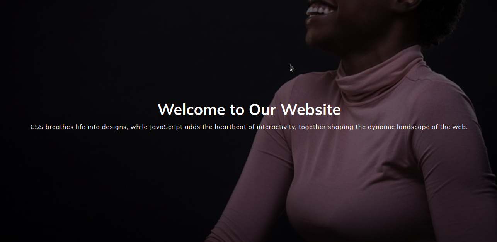

  

# Sticky Navbar - Learning Project

🚀 This is a simple project aimed at practicing and exploring the creation of a Sticky Navbar using JavaScript and CSS.

# Preview

  

## Description

In this project, we implemented a Sticky Navbar that remains fixed at the top of the page as the user scrolls. JavaScript was used to dynamically add/remove a class based on the scroll position, and CSS to style the appearance of the navbar.

## Resources Used

- HTML5: Basic page structure.
- CSS3: Styles and design for the Navbar.
- JavaScript: Logic to make the Navbar sticky.

## Course & Instructor

This project was inspired by the [50 Projects in 50 Days](https://www.udemy.com/course/50-projects-50-days/) course on Udemy, taught by [Brad Traversy](http://www.traversymedia.com/), an experienced instructor in web development.

## How to Use

1. Clone this repository to your local environment.
2. Open the `index.html` file in your browser.
3. Scroll the page to see the Navbar become sticky when reaching the top.

## Contributions

Contributions are welcomed! If you wish to improve this project with new features, fixes, or enhancements, feel free to submit a pull request.

## License

This project was made for studies purposesand can be used under the [MIT LICENSE](https://opensource.org/license/mit/).
